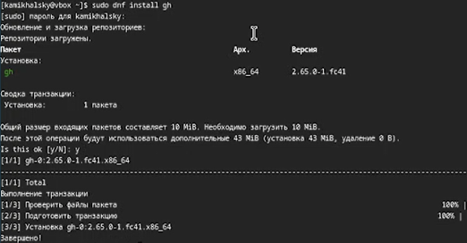

---
## Front matter
lang: ru-RU
title: Презентация по лабораторной работе №2
subtitle: Архитектура системы
author:
  - Михальский К. А.
institute:
  - Российский университет дружбы народов, Москва, Россия
date: 5 марта 2025

## i18n babel
babel-lang: russian
babel-otherlangs: english

## Formatting pdf
toc: false
toc-title: Содержание
slide_level: 2
aspectratio: 169
section-titles: true
theme: metropolis
header-includes:
 - \metroset{progressbar=frametitle,sectionpage=progressbar,numbering=fraction}
---

# Информация

## Докладчик

:::::::::::::: {.columns align=center}
::: {.column width="70%"}

  * Михальский Кирилл Алексеевич
  * студет 1 курса
  * Российский университет дружбы народов
  * [kmikhalsky@gmail.com](mailto:kmikhalsky@gmail.com)

:::
::: {.column width="30%"}

:::
::::::::::::::

# Вводная часть

## Актуальность

- СКВ позволяет отслеживать изменения в проекте
- Система контроля версий позволяет отслеживать разработку в команде
- СКВ позволяет хранить историю разработки проекта
- Умение спользовать git широко востребовано в ИТ среде

## Объект и предмет исследования

- Идеология СКВ
- Применение средств СКВ
- Работа с git

# Задание

1. Установка git & gh
2. Базовая настройка
3. Создание ключа ssh
4. Создание ключа pgp
5. Настройка github
6. Добавление ключей
7. Настройка автоматических подписей
8. Настройка gh
9. Шаблон рабочего пространства

# Теоретическое введение

Системы контроля версий применяются при работе несколькими людьми над одним проектом. Одна из самых распространенных систем контроля версий - git. 

# Выполнение лабораторной работы

1. Гит уже был скачан. Установка gh.

{#fig:001 width=70%}

##
2. Устанавливаю базовые настройки.

{#fig:002 width=70%}

##
3. Создаю ключ ssh

{#fig:003 width=70%}

##
4. Создаю ключ pgp с нужными настройками.

{#fig:004 width=70%}

##
5. Гитхаб уже был настроен.

##
6. Добавление ключей в github по стандартной схеме. Столкнулся с проблемой windows(хост), которая не давала мне подключить ключ, но другой способ аутентификации разрешил проблему.

{#fig:005 width=70%}

##
7. Настроил автоматическую подпись комитов

{#fig:006 width=70%}

##
8. Настроил gh

{#fig:007 width=70%}

##
9. Создал необходимые каталоги

{#fig:008 width=70%}

##
Настроил каталог курса.

{#fig:009 width=70%}

# Выводы

1. Изучил идеологию и применение средств контроля версий.
2. Освоил умения по работе с git.

:::

