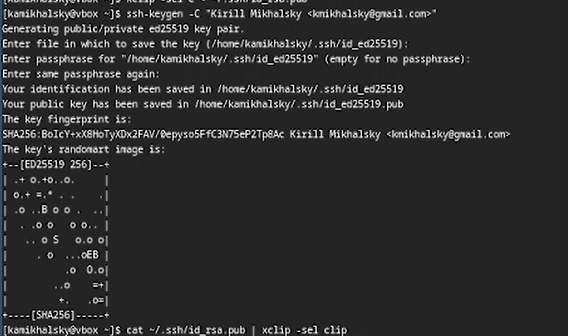

---
## Front matter
title: "Отчет по лабораторной работе №2"
subtitle: "Архитектура ОС"
author: "Михальский Кирилл Алексеевич"

## Generic otions
lang: ru-RU
toc-title: "Содержание"

## Bibliography
bibliography: bib/cite.bib
csl: pandoc/csl/gost-r-7-0-5-2008-numeric.csl

## Pdf output format
toc: true # Table of contents
toc-depth: 2
lof: true # List of figures
lot: true # List of tables
fontsize: 12pt
linestretch: 1.5
papersize: a4
documentclass: scrreprt
## I18n polyglossia
polyglossia-lang:
  name: russian
  options:
	- spelling=modern
	- babelshorthands=true
polyglossia-otherlangs:
  name: english
## I18n babel
babel-lang: russian
babel-otherlangs: english
## Fonts
mainfont: IBM Plex Serif
romanfont: IBM Plex Serif
sansfont: IBM Plex Sans
monofont: IBM Plex Mono
mathfont: STIX Two Math
mainfontoptions: Ligatures=Common,Ligatures=TeX,Scale=0.94
romanfontoptions: Ligatures=Common,Ligatures=TeX,Scale=0.94
sansfontoptions: Ligatures=Common,Ligatures=TeX,Scale=MatchLowercase,Scale=0.94
monofontoptions: Scale=MatchLowercase,Scale=0.94,FakeStretch=0.9
mathfontoptions:
## Biblatex
biblatex: true
biblio-style: "gost-numeric"
biblatexoptions:
  - parentracker=true
  - backend=biber
  - hyperref=auto
  - language=auto
  - autolang=other*
  - citestyle=gost-numeric
## Pandoc-crossref LaTeX customization
figureTitle: "Рис."
tableTitle: "Таблица"
listingTitle: "Листинг"
lofTitle: "Список иллюстраций"
lotTitle: "Список таблиц"
lolTitle: "Листинги"
## Misc options
indent: true
header-includes:
  - \usepackage{indentfirst}
  - \usepackage{float} # keep figures where there are in the text
  - \floatplacement{figure}{H} # keep figures where there are in the text
---

# Цель работы

1. Изучить идеологию и применение средств контроля версий.
2. Освоить умения по работе с git.

# Задание

1. Установка git & gh
2. Базовая настройка
3. Создание ключа ssh
4. Создание ключа pgp
5. Настройка github
6. Добавление ключей
7. Настройка автоматических подписей
8. Настройка gh
9. Шаблон рабочего пространства

# Теоретическое введение

Системы контроля версий применяются при работе несколькими людьми над одним проектом. Одна из самых распространенных систем контроля версий - git. 

# Выполнение лабораторной работы

1. Гит уже был скачан. Установка gh.

{#fig:001 width=70%}

2. Устанавливаю базовые настройки.

{#fig:002 width=70%}

3. Создаю ключ ssh

{#fig:003 width=70%}

4. Создаю ключ pgp с нужными настройками.

{#fig:004 width=70%}

5. Гитхаб уже был настроен.

6. Добавление ключей в github по стандартной схеме. Столкнулся с проблемой windows(хост), которая не давала мне подключить ключ, но другой способ аутентификации разрешил проблему.

{#fig:005 width=70%}

7. Настроил автоматическую подпись комитов

{#fig:006 width=70%}

8. Настроил gh

{#fig:007 width=70%}

9. Создал необходимые каталоги

{#fig:008 width=70%}

Настроил каталог курса.

{#fig:009 width=70%}

# Выводы

1. Изучил идеологию и применение средств контроля версий.
2. Освоил умения по работе с git.

# Список литературы{.unnumbered}

::: {#refs}
:::
