---
## Front matter
lang: ru-RU
title: Презентация по лабораторной работе №4
subtitle: Архитектура системы
author:
  - Михальский Кирилл
institute:
  - Российский университет дружбы народов, Москва, Россия
date: 07 марта 2025

## i18n babel
babel-lang: russian
babel-otherlangs: english

## Formatting pdf
toc: false
toc-title: Содержание
slide_level: 2
aspectratio: 169
section-titles: true
theme: metropolis
header-includes:
 - \metroset{progressbar=frametitle,sectionpage=progressbar,numbering=fraction}
---

# Информация

## Докладчик

:::::::::::::: {.columns align=center}
::: {.column width="70%"}

  * Михальский Кирилл Алексеевич
  * студент 1 курса
  * Российский университет дружбы народов

:::
::: {.column width="30%"}

:::
::::::::::::::

# Вводная часть

## Актуальность

- СКВ позволяет отслеживать изменения в проекте
- Система контроля версий позволяет отслеживать разработку в команде
- СКВ позволяет хранить историю разработки проекта
- Умение спользовать git широко востребовано в ИТ среде

## Объект и предмет исследования

- git

# Цель работы

Получение навыков правильной работы с репозиториями git.

# Задание

   * Выполнить работу для тестового репозитория.
   * Преобразовать рабочий репозиторий в репозиторий с git-flow и conventional commits.

# Теоретическое введение

    Gitflow Workflow опубликована и популяризована Винсентом Дриссеном.
    Gitflow Workflow предполагает выстраивание строгой модели ветвления с учётом выпуска проекта.
    Данная модель отлично подходит для организации рабочего процесса на основе релизов.
    Работа по модели Gitflow включает создание отдельной ветки для исправлений ошибок в рабочей среде.
    Последовательность действий при работе по модели Gitflow:
        Из ветки master создаётся ветка develop.
        Из ветки develop создаётся ветка release.
        Из ветки develop создаются ветки feature.
        Когда работа над веткой feature завершена, она сливается с веткой develop.
        Когда работа над веткой релиза release завершена, она сливается в ветки develop и master.
        Если в master обнаружена проблема, из master создаётся ветка hotfix.
        Когда работа над веткой исправления hotfix завершена, она сливается в ветки develop и master.

# Выполнение лабораторной работы

1. Установил git-flow & gh

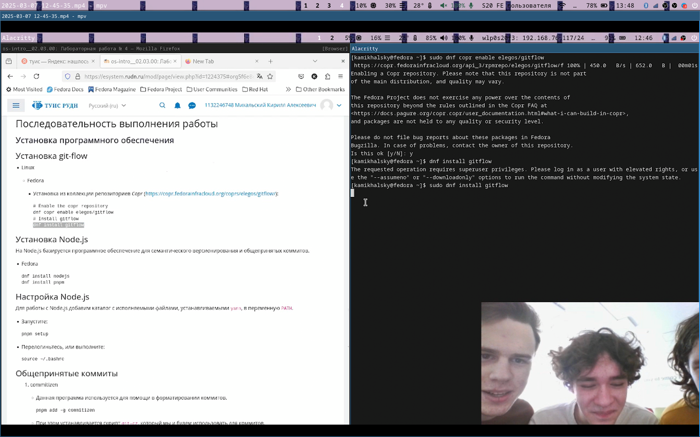{#fig:001 width=70%}
 
##

 Установил node-js & pnpm
 
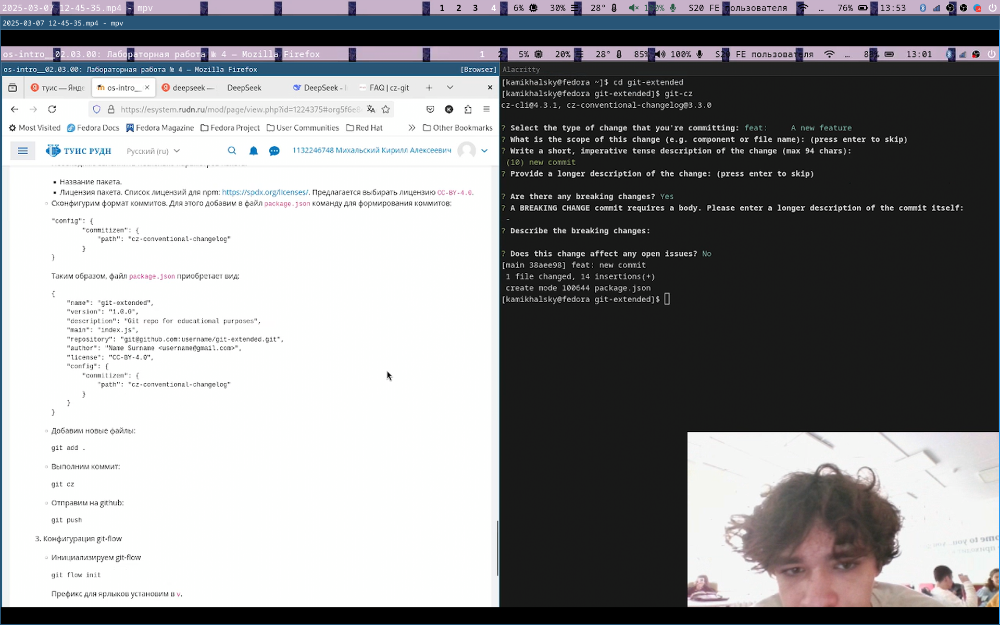{#fig:002 width=70%}

##

 Настроил node-js командой source ~/.bash 
 
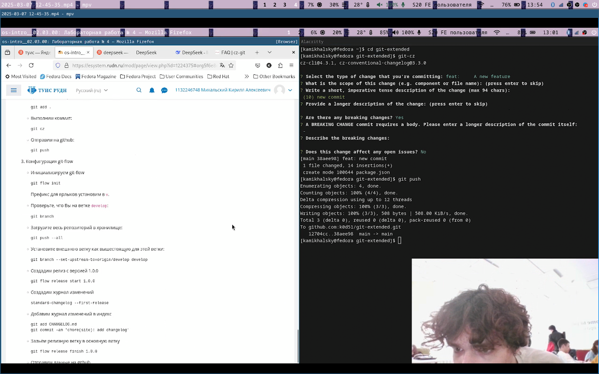{#fig:003 width=70%}

##

 Установил commitizen & standard-changelog 
 
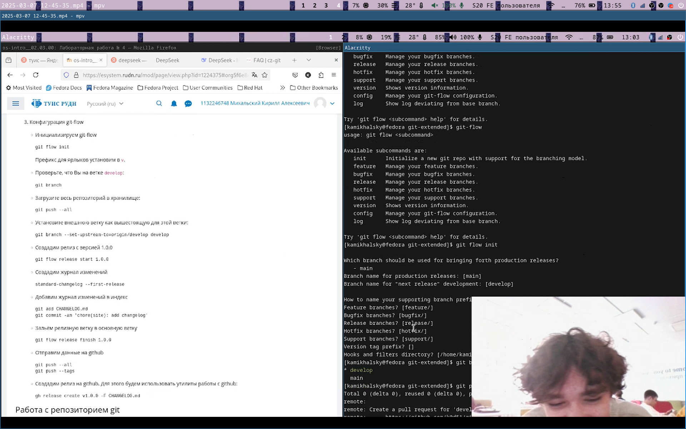{#fig:004 width=70%}

##
 
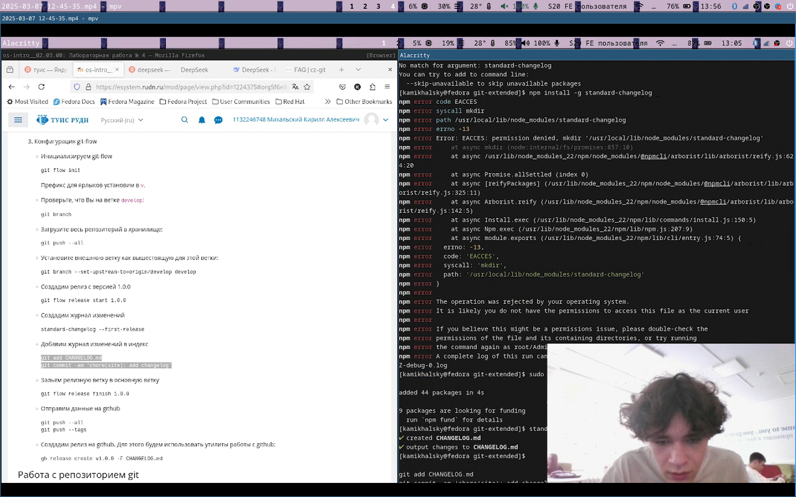{#fig:005 width=70%}

##

1. Создал репозиторий git-extended. Сделал первый коммит и выложил на github. 

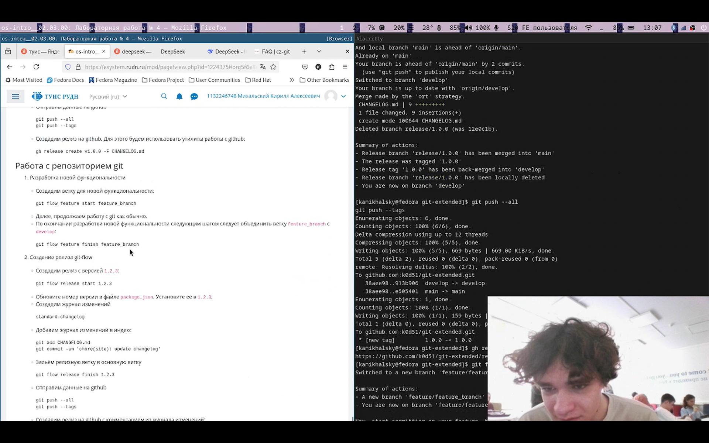{#fig:006 width=70%}

##

2. Инициализировал pnpm и изменил конфигурацию конфигов. 

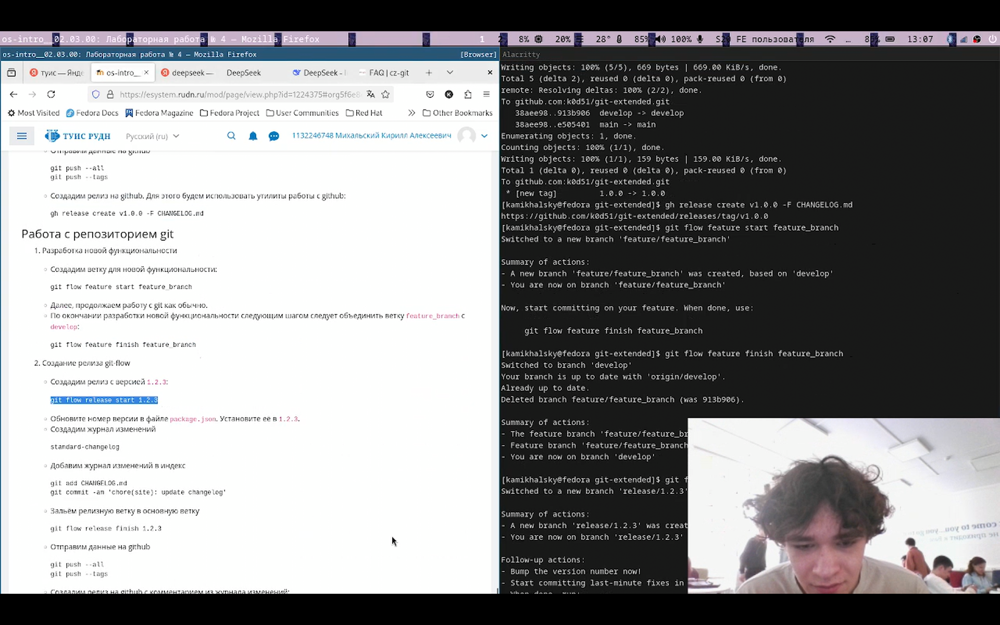{#fig:007 width=70%}

##

 Добавил новые файлы и отправил на github. 
 
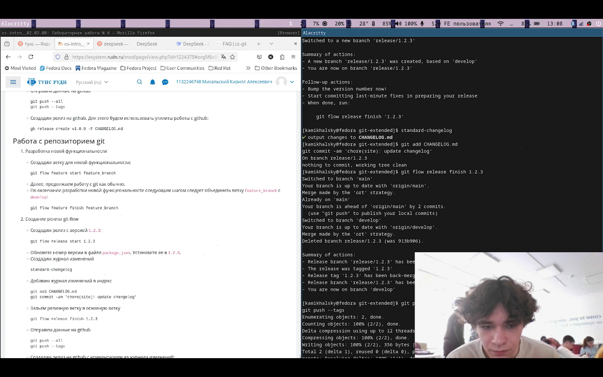{#fig:008 width=70%}

##

3. Инициализировал git-flow 

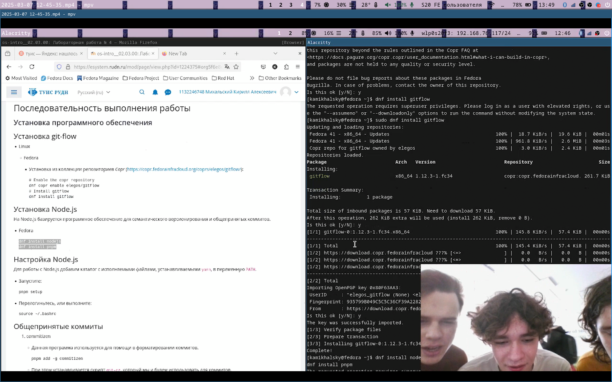{#fig:009 width=70%}

##

 Проверил ветку, загрузил весь репозиторий. Установил внешнюю ветку как вышестояющую, создал релиз и журнал изменений.
 
{#fig:010 width=70%}

 Залил релизную ветку в основную и отправил на github. Создал релиз на github
 
##

1. Создал ветку для новой функциональности и объединил ветки.

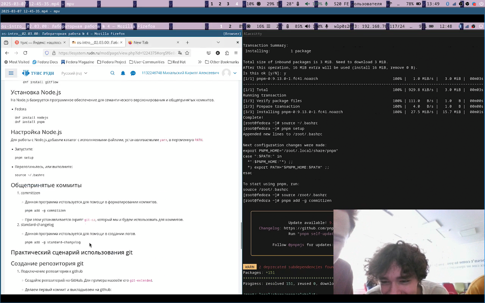{#fig:011 width=70%}

##

2. Создал новый релиз, обновил версию. Создал журнал изменений и добавил его в индекс.

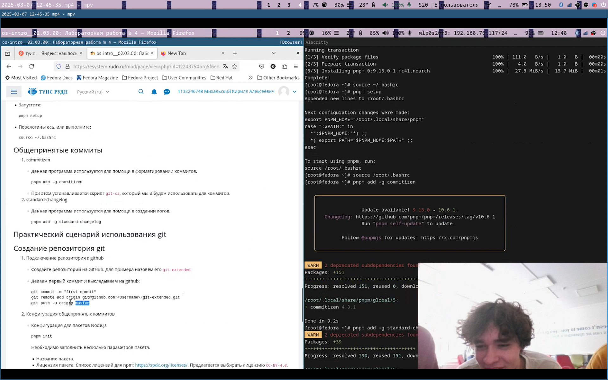{#fig:012 width=70%}

##

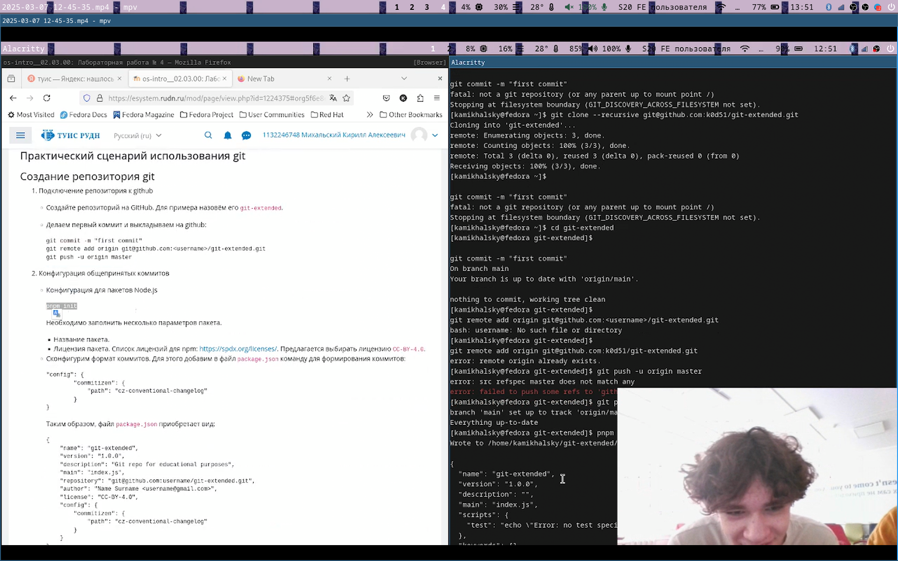{#fig:013 width=70%}

##

 Отправил релиз в github с комментариями из журнала.
 
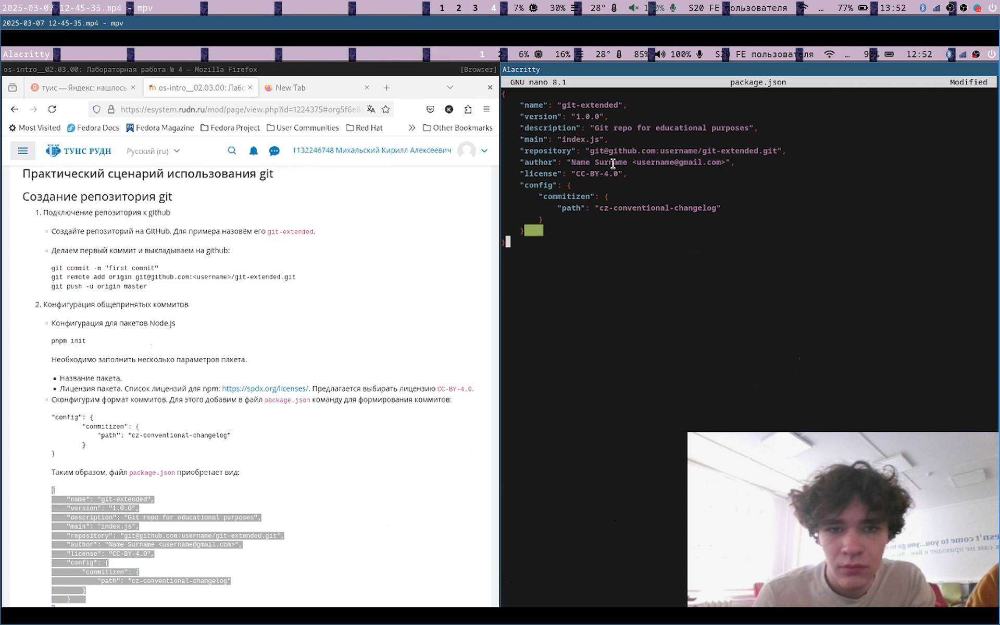{#fig:014 width=70%}

##

# Выводы

Получил навыки правильной работы с репозиториями git.

:::

