---
## Front matter
title: "Отчет по лаораторной работе №4"
subtitle: "Архитектура системы"
author: "Михальский кирилл Алексеевич"

## Generic otions
lang: ru-RU
toc-title: "Содержание"

## Bibliography
bibliography: bib/cite.bib
csl: pandoc/csl/gost-r-7-0-5-2008-numeric.csl

## Pdf output format
toc: true # Table of contents
toc-depth: 2
lof: true # List of figures
lot: true # List of tables
fontsize: 12pt
linestretch: 1.5
papersize: a4
documentclass: scrreprt
## I18n polyglossia
polyglossia-lang:
  name: russian
  options:
	- spelling=modern
	- babelshorthands=true
polyglossia-otherlangs:
  name: english
## I18n babel
babel-lang: russian
babel-otherlangs: english
## Fonts
mainfont: IBM Plex Serif
romanfont: IBM Plex Serif
sansfont: IBM Plex Sans
monofont: IBM Plex Mono
mathfont: STIX Two Math
mainfontoptions: Ligatures=Common,Ligatures=TeX,Scale=0.94
romanfontoptions: Ligatures=Common,Ligatures=TeX,Scale=0.94
sansfontoptions: Ligatures=Common,Ligatures=TeX,Scale=MatchLowercase,Scale=0.94
monofontoptions: Scale=MatchLowercase,Scale=0.94,FakeStretch=0.9
mathfontoptions:
## Biblatex
biblatex: true
biblio-style: "gost-numeric"
biblatexoptions:
  - parentracker=true
  - backend=biber
  - hyperref=auto
  - language=auto
  - autolang=other*
  - citestyle=gost-numeric
## Pandoc-crossref LaTeX customization
figureTitle: "Рис."
tableTitle: "Таблица"
listingTitle: "Листинг"
lofTitle: "Список иллюстраций"
lotTitle: "Список таблиц"
lolTitle: "Листинги"
## Misc options
indent: true
header-includes:
  - \usepackage{indentfirst}
  - \usepackage{float} # keep figures where there are in the text
  - \floatplacement{figure}{H} # keep figures where there are in the text
---

# Цель работы

Получение навыков правильной работы с репозиториями git.

# Задание

   * Выполнить работу для тестового репозитория.
   * Преобразовать рабочий репозиторий в репозиторий с git-flow и conventional commits.

# Теоретическое введение

    Gitflow Workflow опубликована и популяризована Винсентом Дриссеном.
    Gitflow Workflow предполагает выстраивание строгой модели ветвления с учётом выпуска проекта.
    Данная модель отлично подходит для организации рабочего процесса на основе релизов.
    Работа по модели Gitflow включает создание отдельной ветки для исправлений ошибок в рабочей среде.
    Последовательность действий при работе по модели Gitflow:
        Из ветки master создаётся ветка develop.
        Из ветки develop создаётся ветка release.
        Из ветки develop создаются ветки feature.
        Когда работа над веткой feature завершена, она сливается с веткой develop.
        Когда работа над веткой релиза release завершена, она сливается в ветки develop и master.
        Если в master обнаружена проблема, из master создаётся ветка hotfix.
        Когда работа над веткой исправления hotfix завершена, она сливается в ветки develop и master.

# Выполнение лабораторной работы

1. Установил git-flow & gh (рис. [-@fig:001]).

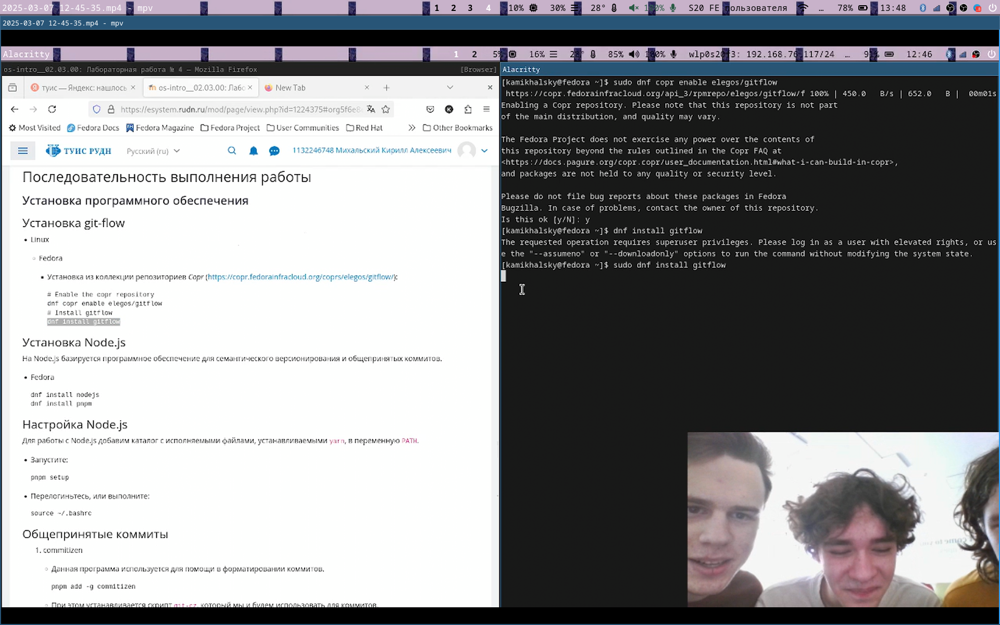{#fig:001 width=70%}

 Установил node-js & pnpm (рис. [-@fig:002]).
 
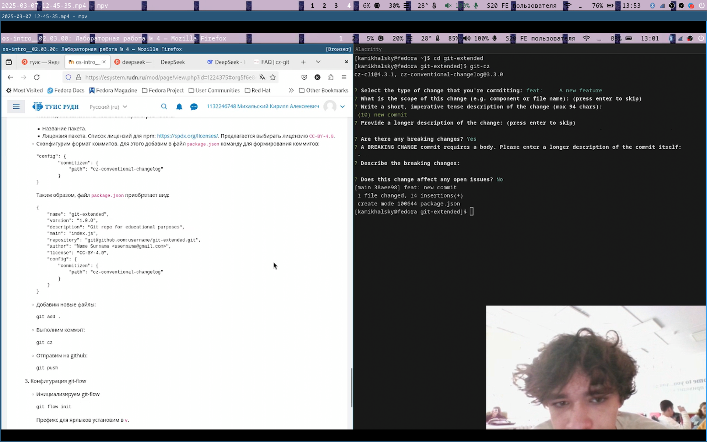{#fig:002 width=70%}

 Настроил node-js командой source ~/.bash (рис. [-@fig:003]).
 
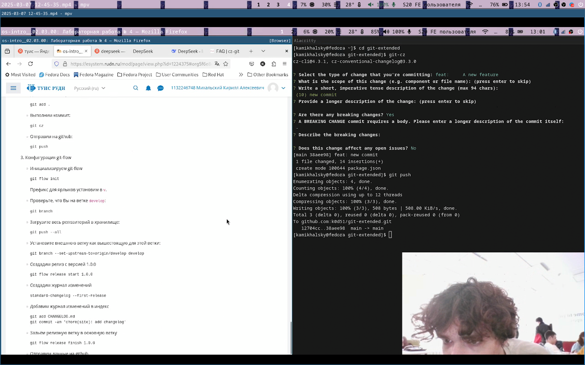{#fig:003 width=70%}

 Установил commitizen & standard-changelog [-@fig:004]).
 
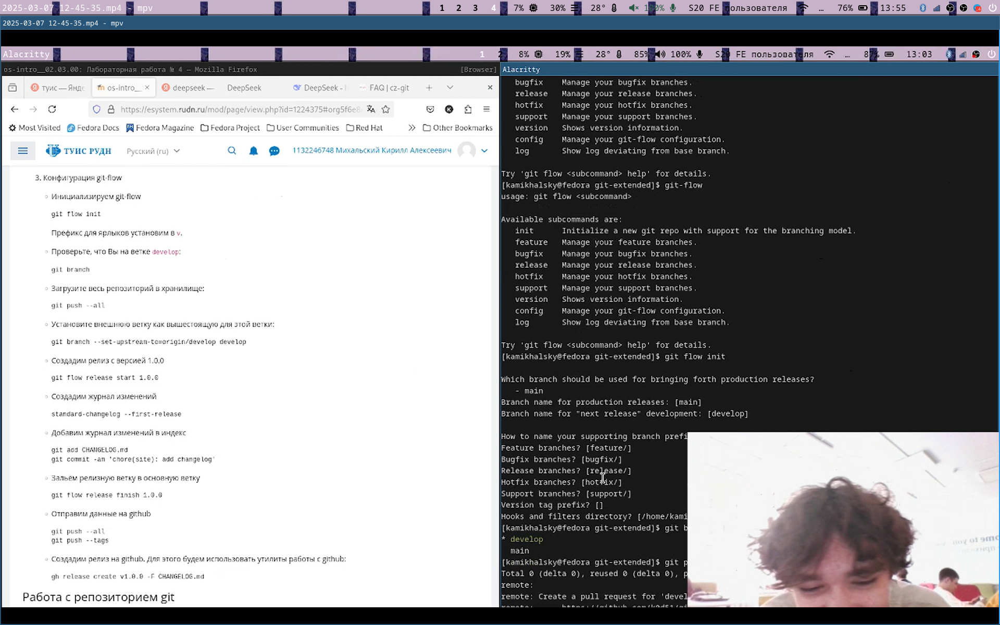{#fig:004 width=70%}
 
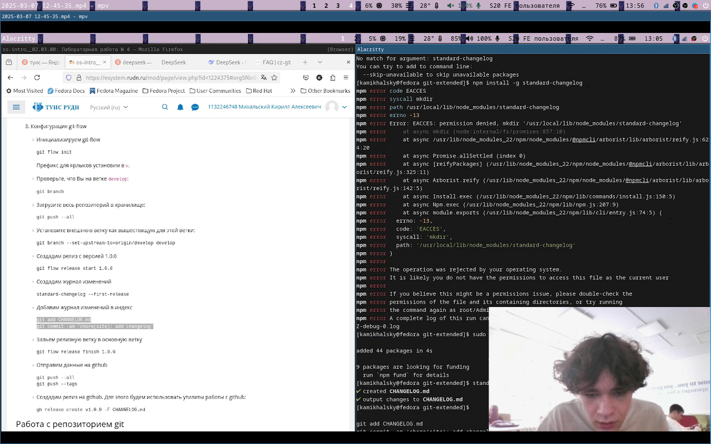{#fig:005 width=70%}

1. Создал репозиторий git-extended. Сделал первый коммит и выложил на github. (рис. [-@fig:006]).

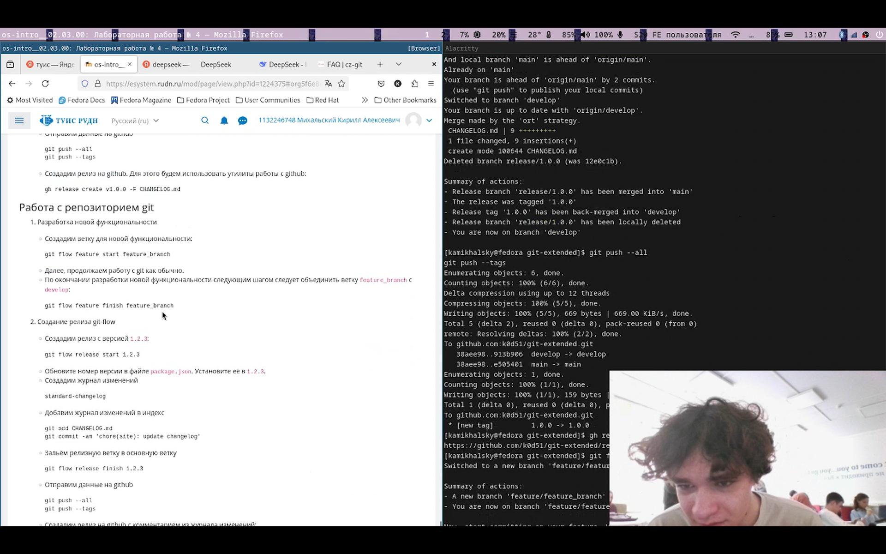{#fig:006 width=70%}

2. Инициализировал pnpm и изменил конфигурацию конфигов. (рис. [-@fig:007]).

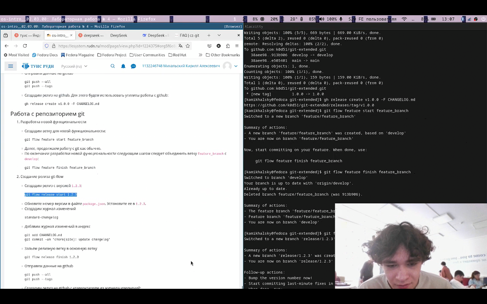{#fig:007 width=70%}

 Добавил новые файлы и отправил на github. (рис. [-@fig:008]).
 
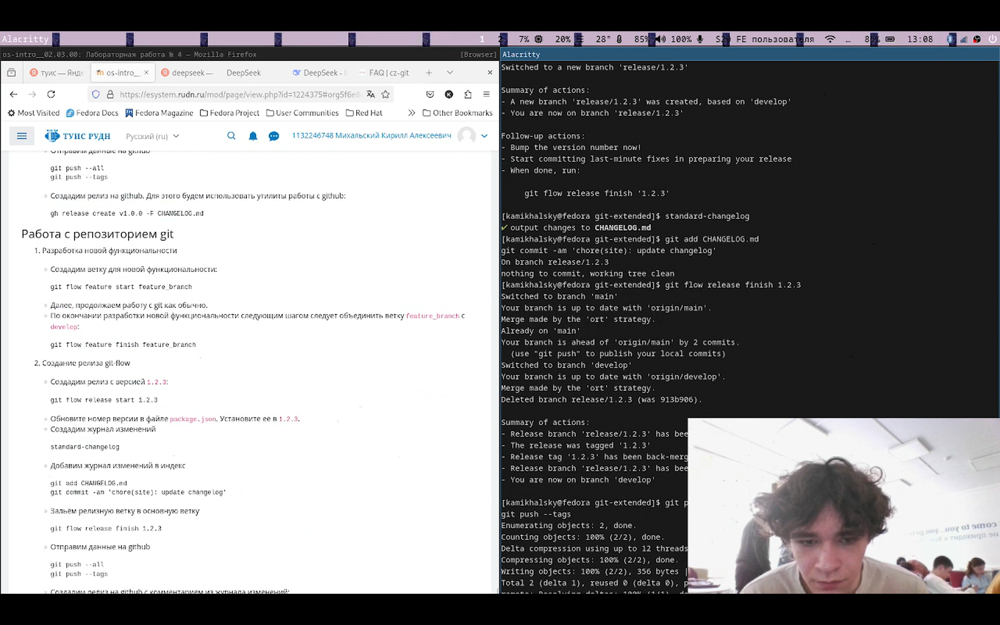{#fig:008 width=70%}

3. Инициализировал git-flow (рис. [-@fig:09]).

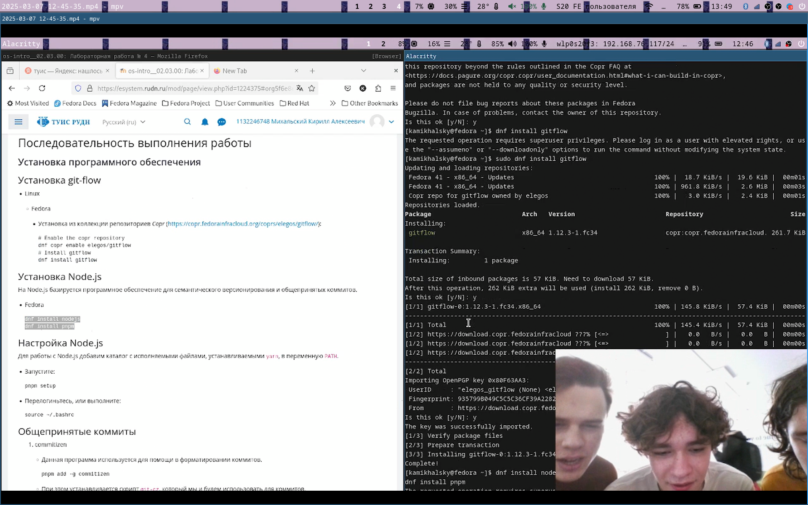{#fig:009 width=70%}

 Проверил ветку, загрузил весь репозиторий. Установил внешнюю ветку как вышестояющую, создал релиз и журнал изменений. (рис. [-@fig:010]).
 
{#fig:010 width=70%}

 Залил релизную ветку в основную и отправил на github. Создал релиз на github

1. Создал ветку для новой функциональности и объединил ветки. (рис. [-@fig:011]).

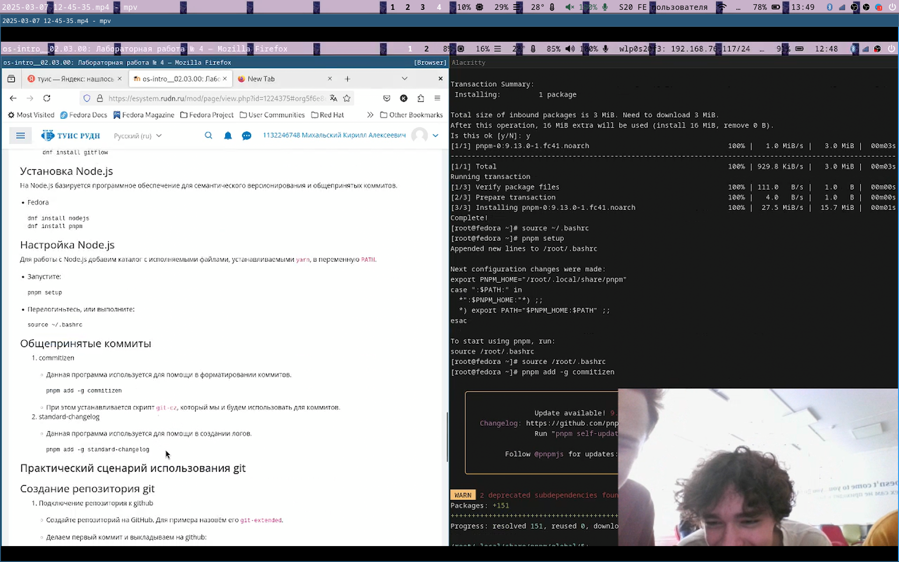{#fig:011 width=70%}

2. Создал новый релиз, обновил версию. Создал журнал изменений и добавил его в индекс. (рис. [-@fig:013]).

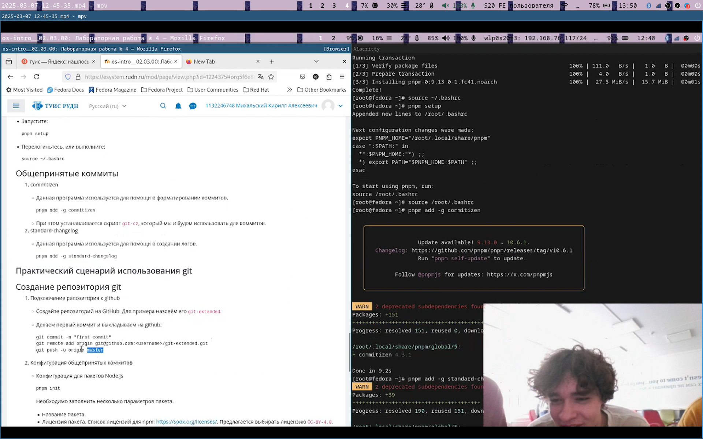{#fig:012 width=70%}

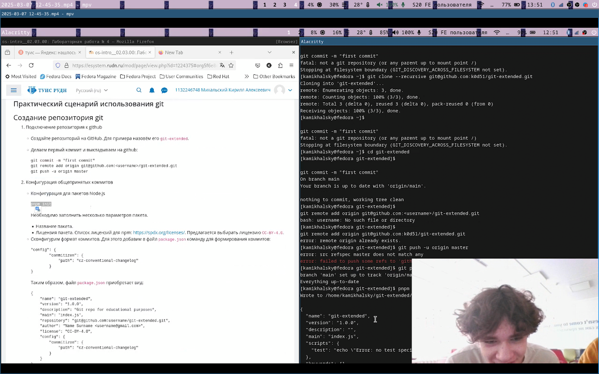{#fig:013 width=70%}

 Отправил релиз в github с комментариями из журнала. (рис. [-@fig:014]).
 
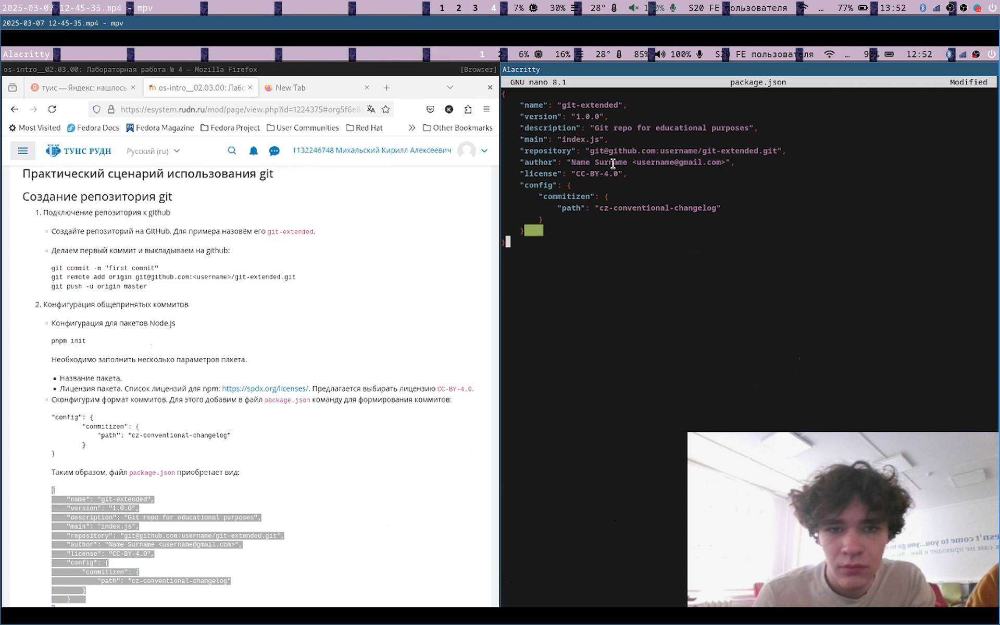{#fig:014 width=70%}

# Выводы

Получил навыки правильной работы с репозиториями git.

# Список литературы{.unnumbered}

::: {#refs}
:::
